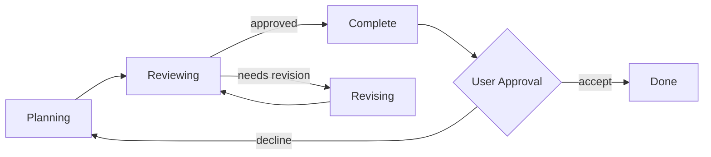
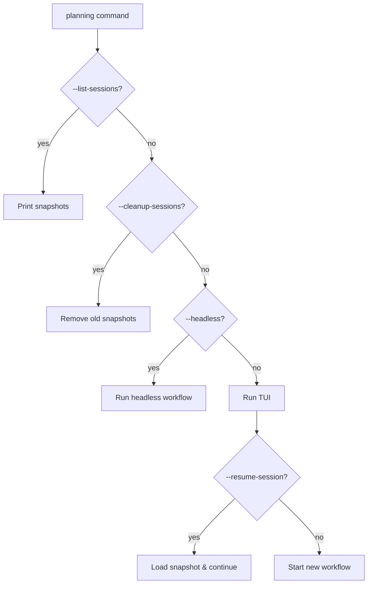

# Planning Agent

TUI/headless tool for iterative implementation planning with configurable AI agents.

## Workflow



Phases:
- **Planning**: Agent generates `plan.md` based on objective.
- **Reviewing**: One or more agents evaluate plan; any rejection triggers revision.
- **Revising**: Agent updates plan based on feedback; loops back to review.
- **Complete**: User approval gate—accept, decline with feedback, or press `[i]` to hand off to Claude Code.

Max iterations (default 3) prevents infinite loops. Reaching max triggers manual review.

## CLI

```
planning [OPTIONS] [OBJECTIVE]...
```

| Flag | Description |
|------|-------------|
| `--headless` | Non-interactive mode (no TUI) |
| `--max-iterations N` | Max review/revise cycles (default: 3) |
| `--config PATH` | Custom workflow.yaml |
| `--name NAME` | Feature name override |
| `--working-dir PATH` | Working directory |
| `--continue` | Resume from existing plan |
| `--resume-session ID` | Resume stopped session |
| `--list-sessions` | List saved session snapshots |
| `--cleanup-sessions` | Remove old snapshots |
| `--older-than DAYS` | Age threshold for cleanup |



## Storage

All data is stored under `~/.planning-agent/`:

```
~/.planning-agent/
├── plans/                          # Plan and feedback files
│   └── <timestamp>-<uuid>_<feature>/
│       ├── plan.md
│       └── feedback_<N>.md
├── sessions/                       # Session snapshots
│   └── <session-id>.json
├── state/<wd-hash>/                # Workflow state (per working directory)
│   └── <feature>.json
├── logs/<wd-hash>/                 # Logs (per working directory)
│   ├── workflow-<run>.log
│   └── agent-stream-<run>.log
└── update-installed                # Update marker
```

The `<wd-hash>` is a 12-character hex hash of the working directory path, ensuring isolation between projects.

## Agent Configuration

Agents configured via `workflow.yaml` (or `--config`):

```yaml
agents:
  claude:
    command: "claude"
    args: ["-p", "--output-format", "stream-json", "--dangerously-skip-permissions"]
  codex:
    command: "codex"
    args: ["exec", "--json", "--dangerously-bypass-approvals-and-sandbox"]
  gemini:
    command: "gemini"
    args: ["-p", "--output-format", "json"]

workflow:
  planning:
    agent: codex
  reviewing:
    agents: [claude, codex]
    aggregation: any_rejects
  revising:
    agent: claude
```

Default: codex plans, claude+codex review (any rejection triggers revision), claude revises.

## Installation

```bash
cargo install --git https://github.com/metjm/planning-agent.git --force
```

Or from source:

```bash
git clone https://github.com/metjm/planning-agent.git
cd planning-agent
./install.sh
```

If `planning` not found: `source "$HOME/.cargo/env"` or add `$HOME/.cargo/bin` to PATH.

## Requirements

- Rust toolchain
- At least one configured AI CLI (claude, codex, or gemini)

## Warning

Uses `--dangerously-skip-permissions` by default. Run in a container.
