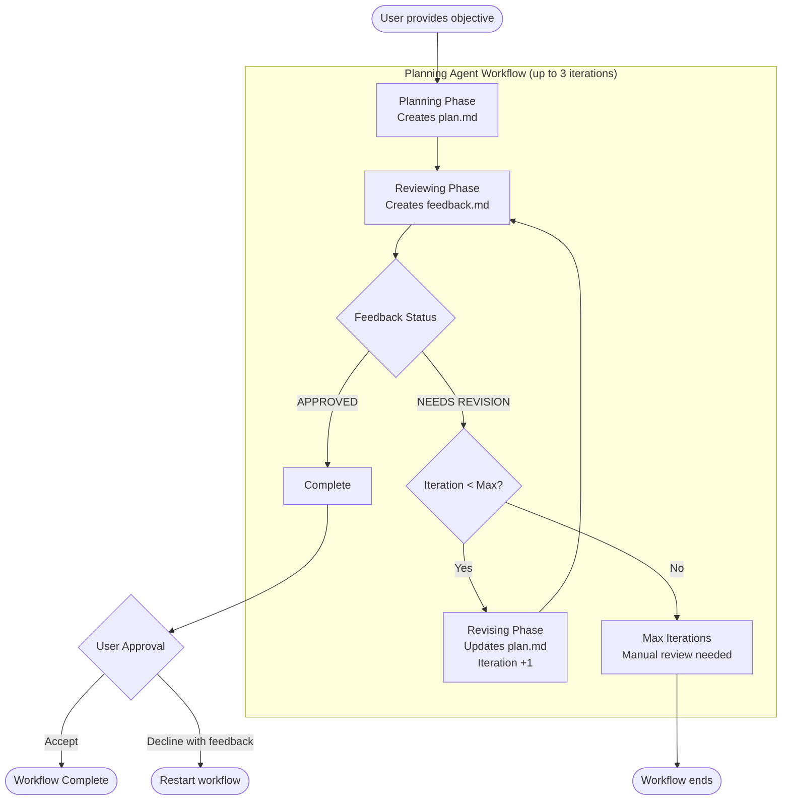

# Planning Agent


A TUI application for creating implementation plans.

## What is Planning Agent?

Planning Agent is a Rust-based terminal user interface (TUI) application that automates the creation of high-quality implementation plans. It orchestrates an iterative plan-review-revise cycle using Claude Code.

**Key Features:**

- **Automated Planning**: Creates comprehensive implementation plans based on your objective
- **AI-Powered Review**: Plans are automatically reviewed for correctness, completeness, and technical accuracy
- **Iterative Refinement**: Plans that need improvement are automatically revised and re-reviewed (up to 3 iterations by default)
- **User Approval Gate**: Final checkpoint where you can accept, decline with feedback, or hand off directly to Claude Code for implementation

## Workflow

The Planning Agent follows an iterative workflow: First, it creates an implementation plan. Then, an AI reviewer evaluates the plan and either approves it or requests revisions. If revisions are needed, the plan is updated and re-reviewed (up to 3 iterations by default). Once approved, the user can accept the final plan, decline with feedback to restart, or press `[i]` to hand off directly to Claude Code for implementation.



> **Note:** When the user approval dialog appears, pressing `[i]` hands off directly to Claude Code for implementation. This terminates the Planning Agent process and is not shown in the diagram as it's not a workflow state transition.

⚠️⚠️⚠️

This uses --dangerously-skip-permissions by default, so I do **NOT** recommend using it without a container.

⚠️⚠️⚠️

## Installation

### Quick Install

```bash
cargo install --git https://github.com/metjm/planning-agent.git --force
```

### From Source

Clone and build locally:

```bash
git clone https://github.com/metjm/planning-agent.git
cd planning-agent
./install.sh
```

### Troubleshooting

If `planning` command is not found after installation:

```bash
source "$HOME/.cargo/env"
```

Or add to your shell profile (~/.bashrc, ~/.zshrc):

```bash
export PATH="$HOME/.cargo/bin:$PATH"
```

## Usage

```bash
planning --help
```

## Requirements

- Rust toolchain (rustc + cargo)
- Git (for cloning)
