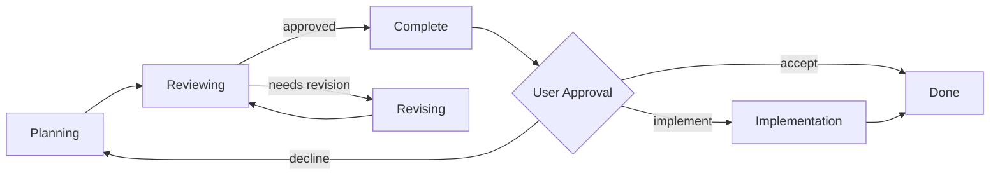

# Planning Agent

TUI/headless tool for iterative implementation planning with configurable AI agents.

## Workflow



Phases:
- **Planning**: Agent generates `plan.md` based on objective.
- **Reviewing**: One or more agents evaluate plan sequentially; any rejection triggers revision.
- **Revising**: Agent updates plan based on feedback; loops back to review.
- **Complete**: User approval gate—accept, decline with feedback, or press `[i]` to hand off to Claude Code.

Max iterations (default 3) prevents infinite loops. Reaching max triggers manual review.

## CLI

```
planning [OPTIONS] [OBJECTIVE]...
```

| Flag | Description |
|------|-------------|
| `--claude` | Use Claude-only workflow (enabled by default) |
| `--max-iterations N` | Max review/revise cycles (default: 3) |
| `--config PATH` | Custom workflow.yaml |
| `--name NAME` | Feature name override |
| `--working-dir PATH` | Working directory |
| `-c, --continue-workflow` | Resume from existing plan |
| `--resume-session ID` | Resume stopped session by ID |
| `--list-sessions` | List saved session snapshots |
| `--cleanup-sessions` | Remove old snapshots |
| `--older-than DAYS` | Age threshold for cleanup |
| `--verify PLAN` | Verify implementation against plan (accepts path, name pattern, or "latest") |
| `--list-plans` | List all available plans |
| `--worktree` | Enable git worktree creation (isolated branch for planning) |
| `--worktree-dir PATH` | Custom directory for git worktree |
| `--worktree-branch NAME` | Custom branch name (default: planning-agent/<feature>-<session-short>) |
| `--no-daemon` | Disable session tracking |

## TUI Commands

In the TUI naming screen, type `/` to access commands:
- `/update` - Install an available update
- `/config-dangerous` - Configure CLI tools to bypass approvals
- `/sessions` - View and resume workflow sessions

## Storage

All data is stored under `~/.planning-agent/`:

```
~/.planning-agent/
├── sessions/<session-id>/          # Session-centric storage (primary)
│   ├── plan.md                     # Implementation plan
│   ├── feedback_<N>_<reviewer>.md  # Review feedback per iteration
│   ├── state.json                  # Workflow state
│   ├── session.json                # Session snapshot (for resume)
│   ├── session_info.json           # Metadata for listing
│   └── logs/
│       ├── session.log             # Main session log
│       └── agent-stream.log        # Raw agent output
├── plans/                          # Legacy plan folders (backward compat)
├── state/<wd-hash>/                # Legacy workflow state
└── logs/<wd-hash>/                 # Legacy logs
```

Legacy paths exist for backward compatibility with existing sessions.

## Agent Configuration

Agents configured via `workflow.yaml` (or `--config`):

```yaml
agents:
  claude:
    command: "claude"
    args:
      - "-p"
      - "--output-format"
      - "stream-json"
      - "--verbose"
      - "--dangerously-skip-permissions"
    allowed_tools:
      - "Read"
      - "Glob"
      - "Grep"
      - "Bash"

workflow:
  planning:
    agent: claude
    max_turns: 200
  reviewing:
    agents:
      - claude
      - agent: claude
        id: claude-practices
        prompt: |
          Focus on repository practices and code reuse.
      - agent: claude
        id: claude-completeness
        prompt: |
          Focus on completeness and edge cases.
    aggregation: any_rejects
    sequential: true

implementation:
  enabled: true
  max_iterations: 3
  implementing:
    agent: claude
    max_turns: 100
  reviewing:
    agent: claude
```

Default (`--claude`, enabled by default): Claude plans and revises, multiple Claude reviewers with specialized prompts run sequentially. Any rejection triggers revision.

**Sequential Review**: Reviewers run one at a time. On rejection, revision happens immediately and all reviewers re-review from the beginning.

**Session Continuity**: Revision resumes the planning agent's session, providing full context continuity.

## Implementation Workflow

After plan approval, press `[i]` to hand off to Claude Code for implementation:


The implementation workflow:
1. Claude Code implements the approved plan
2. A separate reviewer validates the implementation against the plan
3. On failure, implementation iterates (max 3 by default)

Configure in `workflow.yaml` under `implementation:` section.

## Plan Verification

Verify implementation against an approved plan:

```bash
# Verify against the most recent plan
planning --verify latest

# Verify against a specific plan
planning --verify my-feature
planning --verify /path/to/plan.md

# List available plans
planning --list-plans
```

Verification runs the verifying agent to check if the current codebase matches the approved plan.

## Installation

```bash
cargo install --git https://github.com/metjm/planning-agent.git --force
```

Or from source:

```bash
git clone https://github.com/metjm/planning-agent.git
cd planning-agent
./install.sh
```

If `planning` not found: `source "$HOME/.cargo/env"` or add `$HOME/.cargo/bin` to PATH.

## Skills

On startup, planning-agent auto-installs Claude Code skills to:
- `~/.claude/skills/`
- `~/.codex/skills/` (if CODEX_HOME set)

Installed skills:
- `planning` - Implementation planning skill
- `plan-review` - Plan review skill
- `implementation` - Implementation skill
- `implementation-review` - Implementation review skill
- `methodical-debugging` - Debugging skill

## Requirements

- Rust toolchain
- Claude CLI (default workflow uses Claude-only mode)
- Optional: codex, gemini CLIs for multi-agent workflows

## Warning

Uses `--dangerously-skip-permissions` by default. Run in a container.
